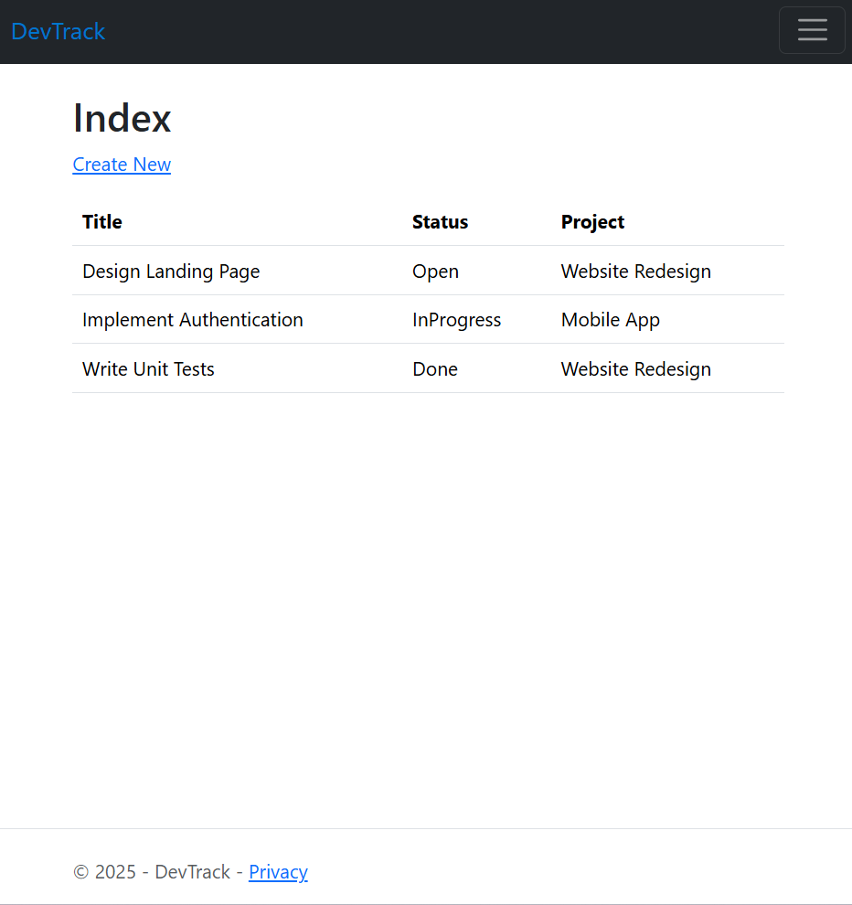

# DevTrack

A lightweight ASP.NET Core MVC app to manage projects and tasks.

## Features
- Dashboard with project/task stats
- CRUD for Projects & Tasks
- Status tracking (Open, In Progress, Done)
- Bootstrap 5 responsive UI
- SQLite database

## Tech Stack
- ASP.NET Core 10 (MVC)
- Entity Framework Core
- SQLite
- Bootstrap 5

## Setup
1. Clone repo
2. Open in Visual Studio
3. Build & Run (F5)
4. Enjoy your dashboard!

## Screenshots

